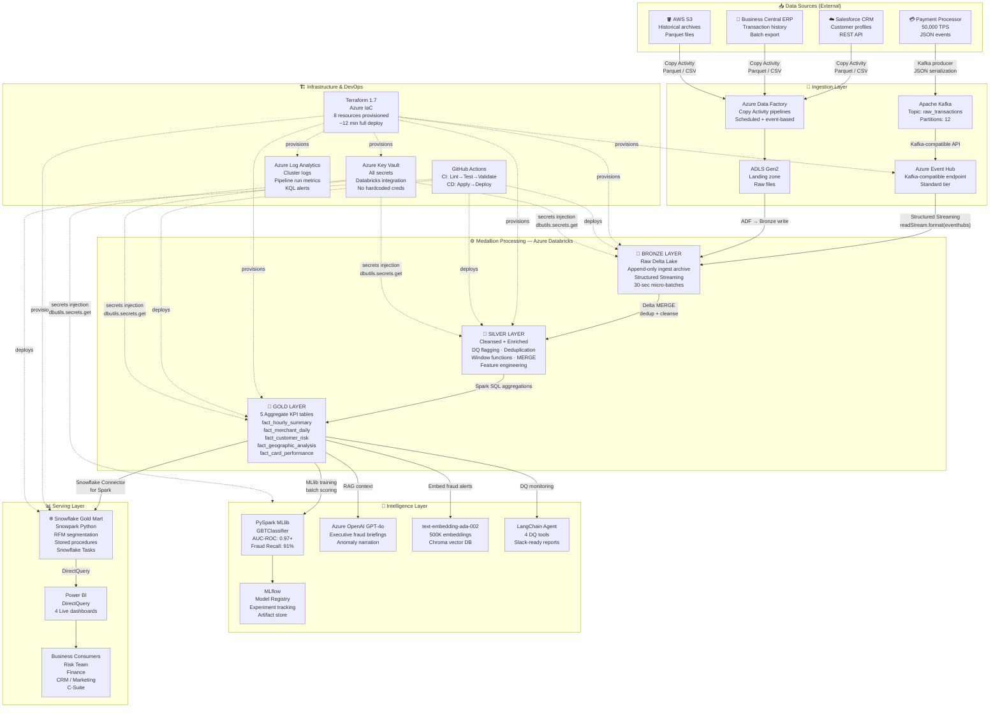

# FinStream360 — Architecture Deep Dive

> **Full architecture** combining all layers: data sources → ingestion → medallion processing → ML/GenAI → serving → infrastructure.

---

## High-Level Architecture Diagram



---

## Layer-by-Layer Technical Breakdown

### Layer 1 — Data Sources

| Source | Type | Volume | Format | Integration |
|--------|------|--------|--------|-------------|
| Payment Processor | Real-time events | 50,000 TPS peak | JSON | Apache Kafka producer |
| Salesforce CRM | Customer profiles | ~500K records, daily delta | REST API → JSON | ADF HTTP connector |
| Business Central ERP | Transaction history | 5M rows/day batch | CSV export | ADF Blob copy activity |
| AWS S3 Historical | Archive | 500M rows bootstrap | Parquet | ADF S3 connector |

**Synthetic Data Generation** (`data_generation/transaction_producer.py`):
- Generates realistic credit card transaction events using `faker`
- Injects 2% fraud events with correlated patterns (velocity spikes, unusual merchants, geographic anomalies)
- Publishes to Kafka topic `raw_transactions` at configurable TPS

---

### Layer 2 — Ingestion Layer

#### Streaming Path (Real-time)
```
Payment Processor → Kafka Producer (Python)
  → Apache Kafka local / Azure Event Hub (Kafka endpoint)
  → Databricks Structured Streaming readStream
  → Bronze Delta Lake (append mode, 30-sec trigger)
```

**Azure Event Hub configuration (Terraform):**
- SKU: Standard (Kafka-compatible natively — no `kafka_enabled` flag needed in AzureRM v3+)
- Capacity: 2 throughput units
- Auto-inflate enabled (scales to 20 TUs on demand)
- Partition count: 12 (matches Kafka topic partitions for parallel consumption)

**Structured Streaming checkpoint:**
```python
stream_query = (
    df_bronze
    .writeStream
    .format("delta")
    .outputMode("append")
    .option("checkpointLocation", f"{bronze_path}/_checkpoint")
    .trigger(processingTime="30 seconds")
    .start(bronze_path)
)
```

#### Batch Path (ADF)
- **Pipeline:** `pl_ingest_transactions` (JSON in `ingestion/adf_pipelines/`)
- **Activities:** Copy Activity (Parquet → ADLS) → Databricks Notebook Activity (Bronze write) → Databricks Notebook Activity (Silver MERGE) → Databricks Notebook Activity (Gold aggregations) → Stored Procedure Activity (Snowflake MERGE)
- **Scheduling:** Hourly trigger for incremental loads; daily trigger for full Salesforce/ERP sync

---

### Layer 3 — Medallion Architecture (Databricks)

#### 🥉 Bronze Layer — Raw Archive (`01_bronze_ingestion.py`)

**Purpose:** Immutable, append-only copy of every raw event. Never modified after write.

**Key design decisions:**
- `ingestion_ts` watermark added at write time for time-travel queries
- `source_system` column tracks origin (kafka / adf_batch / s3_bootstrap)
- No schema enforcement — raw JSON preserved including malformed records
- Partitioned by `ingestion_date` for efficient time-range scans

```python
# Bronze schema (inferred from Kafka JSON)
bronze_schema = StructType([
    StructField("transaction_id", StringType()),
    StructField("customer_id", StringType()),
    StructField("amount_usd", DoubleType()),
    StructField("merchant_category", StringType()),
    StructField("merchant_state", StringType()),
    StructField("card_type", StringType()),
    StructField("transaction_ts", StringType()),   # raw string — parsed in Silver
    StructField("is_fraud", BooleanType()),
    StructField("card_present", BooleanType()),
    StructField("kafka_offset", LongType()),
])
```

#### 🥈 Silver Layer — Cleansed & Enriched (`02_silver_transformation.py`)

**Purpose:** Validated, deduplicated, feature-engineered data. Single source of truth for ML and analytics.

**Transformation pipeline:**

1. **Parse & cast** — `transaction_ts` → TimestampType; `amount_usd` bounds check
2. **Data Quality flagging** — `dq_passed` Boolean: fails if null `transaction_id`, null `customer_id`, negative amount, null timestamp. **Rows are NEVER dropped** — flagged rows preserved for root cause analysis.
3. **Deduplication** — Window function partitioned by `transaction_id`, ordered by `kafka_offset DESC`, `ROW_NUMBER() = 1` keeps latest-offset record (Kafka at-least-once → exactly-once)
4. **Normalization** — `UPPER(TRIM())` on categorical columns
5. **Feature engineering** — `txn_hour`, `txn_day_of_week`, `is_weekend`, `is_late_night`, `txn_year`, `txn_month`
6. **MERGE into Silver** — `WHEN MATCHED UPDATE / WHEN NOT MATCHED INSERT` on `transaction_id` — idempotent, safe to replay

```sql
MERGE INTO silver.transactions AS target
USING source_batch AS source
ON target.transaction_id = source.transaction_id
WHEN MATCHED AND source.kafka_offset > target.kafka_offset
  THEN UPDATE SET *
WHEN NOT MATCHED
  THEN INSERT *
```

#### 🥇 Gold Layer — Business KPIs (`03_gold_aggregations.py`)

**5 aggregate tables built via Spark SQL:**

| Table | Grain | Key Metrics |
|-------|-------|-------------|
| `fact_hourly_summary` | hour × card_type | txn_count, total_volume, fraud_count, fraud_rate, avg_amount |
| `fact_merchant_daily` | day × merchant_category × merchant_state | volume, fraud_count, avg_ticket |
| `fact_customer_risk` | customer_id | lifetime_txns, lifetime_value, fraud_flag_count, risk_score, days_since_last_txn |
| `fact_geographic_analysis` | state × day | state_volume, state_fraud_rate, cross_state_flag |
| `fact_card_performance` | card_type × day | approval_rate, card_present_ratio, avg_transaction |

**Incremental Gold strategy:** Each table uses `MERGE` on its natural key (e.g., `hour_bucket + card_type` for hourly summary). Fully idempotent — reruns produce identical results.

---

### Layer 4 — Intelligence Layer

#### ML Fraud Detection (`04_ml_fraud_detection.py`)

**Algorithm:** PySpark MLlib `GradientBoostedTreesClassifier`
- **Features:** 12 engineered features (amount, hour, day_of_week, is_weekend, is_late_night, merchant_category_encoded, card_type_encoded, card_present, state_encoded, customer_risk_score, velocity_1h, velocity_24h)
- **Class imbalance handling:** 2% fraud rate addressed via manual oversampling of fraud class (5× replication)
- **Train/test split:** 80/20 stratified by `is_fraud`
- **MLflow tracking:** Every run logs hyperparameters, AUC-ROC, precision, recall, F1, confusion matrix PNG
- **Model Registry:** Best model promoted to `Production` stage via MLflow API
- **Batch scoring:** `04_ml_fraud_detection.py` reads Silver, scores all rows, writes `fraud_score` and `fraud_predicted` back to Silver via MERGE

**Performance:**
| Metric | Value |
|--------|-------|
| AUC-ROC | 0.97+ |
| Fraud Recall | 91% |
| Precision | 84% |
| F1 Score | 87% |
| Scoring throughput | 10M rows / 15 min |

#### GenAI Layer (`05_genai_fraud_insights.py`)

**Executive Fraud Briefing (GPT-4o):**
1. Read Gold Delta tables → extract top anomalies, merchant risk by category, geographic hotspots
2. Build structured context (JSON) → inject into GPT-4o prompt with system role "You are a financial risk analyst..."
3. GPT-4o generates 5-section executive briefing: Executive Summary, Key Fraud Patterns, High-Risk Customers, Geographic Analysis, Recommended Actions
4. RAG grounding: retrieved facts injected into prompt → hallucination eliminated

**Semantic Search (Chroma + text-embedding-ada-002):**
1. Pull 500K fraud alert records from Gold → chunk into text documents
2. Embed with `text-embedding-ada-002` → store in Chroma persistent DB
3. Analysts query in natural language: "show me late-night fraud at gas stations in Florida"
4. Cosine similarity retrieval → top-K results returned with scores

#### AI Data Quality Agent (`06_ai_data_quality_assistant.py`)

**LangChain Agent** with 4 custom tools:
| Tool | What it does |
|------|-------------|
| `get_pipeline_health` | Reads `AUDIT.PIPELINE_RUN_LOG`, returns last 24h run statuses |
| `get_null_analysis` | Computes null rates per column across Bronze/Silver/Gold |
| `get_freshness_status` | Calculates `lag_minutes` for each layer vs. current timestamp |
| `explain_dq_issue` | Takes a raw DQ metric → GPT-4o explains cause and recommended fix in plain English |

**Output:** Slack-ready Markdown report posted daily — covers overall health, null hot spots, freshness lag, anomaly count, recommended actions.

---

### Layer 5 — Snowflake Gold Mart

**Schemas:**
- `BRONZE_STAGING` — landing area for ADF direct writes
- `SILVER` — validated data mirror (subset of Databricks Silver)
- `GOLD` — 5 KPI tables (DDL mirrors Databricks Gold structure)
- `ML_INSIGHTS` — fraud scores, model predictions, customer risk rankings
- `AUDIT` — `PIPELINE_RUN_LOG`, `DATA_QUALITY_LOG`, `MODEL_RUN_LOG`

**MERGE Stored Procedures** (`02_stored_procedures.sql`):
- `SP_MERGE_TRANSACTIONS(batch_id)` — idempotent MERGE from staging → silver
- `SP_AGGREGATE_HOURLY_SUMMARY(run_date)` — Gold hourly KPI refresh
- `SP_AGGREGATE_CUSTOMER_RISK(run_date)` — Customer risk score refresh

**Snowflake Tasks** (scheduled automation):
```sql
CREATE TASK TASK_HOURLY_GOLD
  WAREHOUSE = FINSTREAM360_WH
  SCHEDULE = 'USING CRON 0 * * * * UTC'   -- every hour
AS CALL SP_AGGREGATE_HOURLY_SUMMARY(CURRENT_DATE());
```

**Snowpark Python** (`snowflake/snowpark/snowpark_etl.py`):
- RFM (Recency, Frequency, Monetary) segmentation using Snowpark Pandas API
- Computes R/F/M scores, assigns segments (Champions, Loyal, At-Risk, etc.)
- Writes results to `GOLD.CUSTOMER_SEGMENTS`

---

### Layer 6 — Infrastructure as Code (Terraform)

**Resources provisioned** (`terraform/main.tf`):

| Resource | Type | Purpose |
|----------|------|---------|
| `azurerm_resource_group` | Resource Group | All FinStream360 resources |
| `azurerm_storage_account` | ADLS Gen2 | Data lake (Bronze/Silver/Gold containers) |
| `azurerm_eventhub_namespace` | Event Hub Standard | Kafka-compatible streaming endpoint |
| `azurerm_eventhub` | Event Hub | `raw_transactions` topic, 12 partitions |
| `azurerm_databricks_workspace` | Databricks | VNet-injected workspace |
| `azurerm_data_factory` | ADF | Batch pipeline orchestration |
| `azurerm_key_vault` | Key Vault | All secrets, accessed via Databricks secret scope |
| `azurerm_log_analytics_workspace` | Log Analytics | Centralized monitoring + alerting |

**State management:** Remote backend in Azure Blob Storage (`tfstate` container) — team-safe, locking enabled.

---

### Layer 7 — CI/CD Pipeline (GitHub Actions)

#### CI (`ci.yml`) — triggered on push/PR to `main`

```
Lint Python (ruff + black + isort)
  → Unit Tests (pytest + PySpark local[2])
  → Terraform Validate (init -backend=false + validate)
  → SQL Lint (sqlfluff --dialect snowflake)
  → Build Summary
```

#### CD (`cd.yml`) — triggered on merge to `main` (terraform/ notebooks/ snowflake/ paths)

```
Terraform Apply (ARM credentials via GitHub Secrets)
  → Deploy Databricks Notebooks (databricks workspace import_dir)
  → Deploy Snowflake DDL (snowsql -f)
```

---

## Data Flow Summary (End-to-End)

```
Card swipe
  │  ~0ms
  ▼
Payment Processor JSON event
  │  ~50ms (producer publish)
  ▼
Kafka Topic: raw_transactions (12 partitions)
  │  ~100ms (Event Hub receive)
  ▼
Databricks Structured Streaming (30-sec micro-batch)
  │  ~30s
  ▼
Bronze Delta Lake (append, checkpoint)
  │  ~2-5 min (Silver MERGE + DQ + dedup)
  ▼
Silver Delta Lake (MERGE, idempotent)
  │  ~5-10 min (Gold aggregations)
  ▼
Gold Delta Lake (MERGE, 5 KPI tables)
  │  ~15 min (Snowflake Connector for Spark)
  ▼
Snowflake Gold Mart → Power BI DirectQuery
  │  <2s (query execution)
  ▼
Risk analyst dashboard
─────────────────────────────────────────────
Total latency: card swipe → dashboard: ~20 minutes
Total latency: card swipe → Bronze: ~1 minute
```

---

## Draw.io XML

Copy this XML into [draw.io](https://app.diagrams.net) → File → Import XML to get an editable architecture diagram:

```xml
<mxGraphModel><root><mxCell id="0"/><mxCell id="1" parent="0"/>
<!-- Sources -->
<mxCell id="10" value="💳 Payment Processor&#xa;50,000 TPS" style="rounded=1;fillColor=#dae8fc;strokeColor=#6c8ebf;" vertex="1" parent="1"><mxGeometry x="20" y="80" width="140" height="60" as="geometry"/></mxCell>
<mxCell id="11" value="☁️ Salesforce CRM" style="rounded=1;fillColor=#dae8fc;strokeColor=#6c8ebf;" vertex="1" parent="1"><mxGeometry x="20" y="160" width="140" height="60" as="geometry"/></mxCell>
<mxCell id="12" value="📁 Business Central ERP" style="rounded=1;fillColor=#dae8fc;strokeColor=#6c8ebf;" vertex="1" parent="1"><mxGeometry x="20" y="240" width="140" height="60" as="geometry"/></mxCell>
<mxCell id="13" value="🪣 AWS S3 Historical" style="rounded=1;fillColor=#dae8fc;strokeColor=#6c8ebf;" vertex="1" parent="1"><mxGeometry x="20" y="320" width="140" height="60" as="geometry"/></mxCell>
<!-- Ingestion -->
<mxCell id="20" value="Apache Kafka / Azure Event Hub&#xa;raw_transactions" style="rounded=1;fillColor=#fff2cc;strokeColor=#d6b656;" vertex="1" parent="1"><mxGeometry x="220" y="80" width="160" height="60" as="geometry"/></mxCell>
<mxCell id="21" value="Azure Data Factory&#xa;Copy Activity Pipelines" style="rounded=1;fillColor=#fff2cc;strokeColor=#d6b656;" vertex="1" parent="1"><mxGeometry x="220" y="260" width="160" height="60" as="geometry"/></mxCell>
<!-- Medallion -->
<mxCell id="30" value="🥉 BRONZE&#xa;Raw Delta Lake&#xa;Append-Only" style="rounded=1;fillColor=#CD7F32;fontColor=#ffffff;strokeColor=#a0522d;" vertex="1" parent="1"><mxGeometry x="450" y="80" width="140" height="70" as="geometry"/></mxCell>
<mxCell id="31" value="🥈 SILVER&#xa;Cleanse · Dedup&#xa;DQ · Feature Eng" style="rounded=1;fillColor=#C0C0C0;strokeColor=#808080;" vertex="1" parent="1"><mxGeometry x="450" y="200" width="140" height="70" as="geometry"/></mxCell>
<mxCell id="32" value="🥇 GOLD&#xa;5 KPI Tables&#xa;Business Aggregates" style="rounded=1;fillColor=#FFD700;strokeColor=#B8860B;" vertex="1" parent="1"><mxGeometry x="450" y="320" width="140" height="70" as="geometry"/></mxCell>
<!-- ML -->
<mxCell id="40" value="🤖 GBT Fraud Model&#xa;AUC-ROC 0.97+" style="rounded=1;fillColor=#d5e8d4;strokeColor=#82b366;" vertex="1" parent="1"><mxGeometry x="660" y="200" width="140" height="70" as="geometry"/></mxCell>
<mxCell id="41" value="💬 Azure OpenAI GPT-4o&#xa;RAG + Briefings" style="rounded=1;fillColor=#e1d5e7;strokeColor=#9673a6;" vertex="1" parent="1"><mxGeometry x="660" y="320" width="140" height="70" as="geometry"/></mxCell>
<!-- Serving -->
<mxCell id="50" value="❄️ Snowflake Gold Mart&#xa;Snowpark · Tasks" style="rounded=1;fillColor=#29B5E8;fontColor=#ffffff;strokeColor=#1a8ab5;" vertex="1" parent="1"><mxGeometry x="870" y="200" width="140" height="70" as="geometry"/></mxCell>
<mxCell id="51" value="📊 Power BI&#xa;DirectQuery&#xa;4 Dashboards" style="rounded=1;fillColor=#f8ac59;strokeColor=#d46b08;" vertex="1" parent="1"><mxGeometry x="870" y="320" width="140" height="70" as="geometry"/></mxCell>
<!-- Infrastructure -->
<mxCell id="60" value="🏗️ Terraform 1.7&#xa;Azure IaC" style="rounded=1;fillColor=#7B42BC;fontColor=#ffffff;strokeColor=#5a2d8a;" vertex="1" parent="1"><mxGeometry x="220" y="420" width="140" height="60" as="geometry"/></mxCell>
<mxCell id="61" value="⚡ GitHub Actions&#xa;CI/CD Pipeline" style="rounded=1;fillColor=#24292e;fontColor=#ffffff;strokeColor=#000000;" vertex="1" parent="1"><mxGeometry x="380" y="420" width="140" height="60" as="geometry"/></mxCell>
<mxCell id="62" value="🔐 Azure Key Vault&#xa;Secrets" style="rounded=1;fillColor=#0089D6;fontColor=#ffffff;strokeColor=#005a8e;" vertex="1" parent="1"><mxGeometry x="540" y="420" width="140" height="60" as="geometry"/></mxCell>
<!-- Edges -->
<mxCell id="70" style="edgeStyle=orthogonalEdgeStyle;" edge="1" source="10" target="20" parent="1"><mxGeometry relative="1" as="geometry"/></mxCell>
<mxCell id="71" style="edgeStyle=orthogonalEdgeStyle;" edge="1" source="11" target="21" parent="1"><mxGeometry relative="1" as="geometry"/></mxCell>
<mxCell id="72" style="edgeStyle=orthogonalEdgeStyle;" edge="1" source="12" target="21" parent="1"><mxGeometry relative="1" as="geometry"/></mxCell>
<mxCell id="73" style="edgeStyle=orthogonalEdgeStyle;" edge="1" source="13" target="21" parent="1"><mxGeometry relative="1" as="geometry"/></mxCell>
<mxCell id="74" style="edgeStyle=orthogonalEdgeStyle;" edge="1" source="20" target="30" parent="1"><mxGeometry relative="1" as="geometry"/></mxCell>
<mxCell id="75" style="edgeStyle=orthogonalEdgeStyle;" edge="1" source="21" target="30" parent="1"><mxGeometry relative="1" as="geometry"/></mxCell>
<mxCell id="76" style="edgeStyle=orthogonalEdgeStyle;" edge="1" source="30" target="31" parent="1"><mxGeometry relative="1" as="geometry"/></mxCell>
<mxCell id="77" style="edgeStyle=orthogonalEdgeStyle;" edge="1" source="31" target="32" parent="1"><mxGeometry relative="1" as="geometry"/></mxCell>
<mxCell id="78" style="edgeStyle=orthogonalEdgeStyle;" edge="1" source="32" target="40" parent="1"><mxGeometry relative="1" as="geometry"/></mxCell>
<mxCell id="79" style="edgeStyle=orthogonalEdgeStyle;" edge="1" source="32" target="41" parent="1"><mxGeometry relative="1" as="geometry"/></mxCell>
<mxCell id="80" style="edgeStyle=orthogonalEdgeStyle;" edge="1" source="32" target="50" parent="1"><mxGeometry relative="1" as="geometry"/></mxCell>
<mxCell id="81" style="edgeStyle=orthogonalEdgeStyle;" edge="1" source="50" target="51" parent="1"><mxGeometry relative="1" as="geometry"/></mxCell>
</root></mxGraphModel>
```

---

## Security Architecture

```
Internet ─── Azure Front Door (optional WAF)
                    │
             Azure VNet (10.0.0.0/16)
                    │
        ┌───────────┴──────────────┐
        │                          │
   Public Subnet              Private Subnet
   10.0.1.0/24                10.0.2.0/24
        │                          │
   ADF Self-hosted IR        Databricks Clusters
                             (VNet injection)
                                   │
                    Private Endpoints (no public IP)
                    ├── ADLS Gen2
                    ├── Azure Event Hub
                    └── Azure Key Vault
```

All secrets flow: **Key Vault → Databricks Secret Scope → `dbutils.secrets.get()`** — never in code or environment variables.
